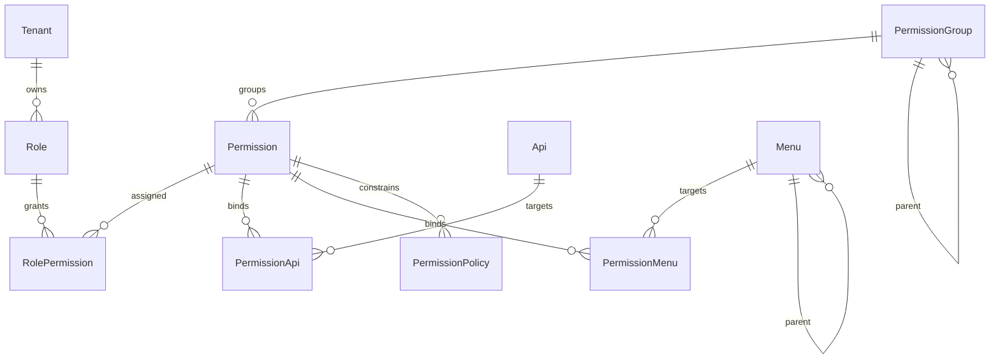
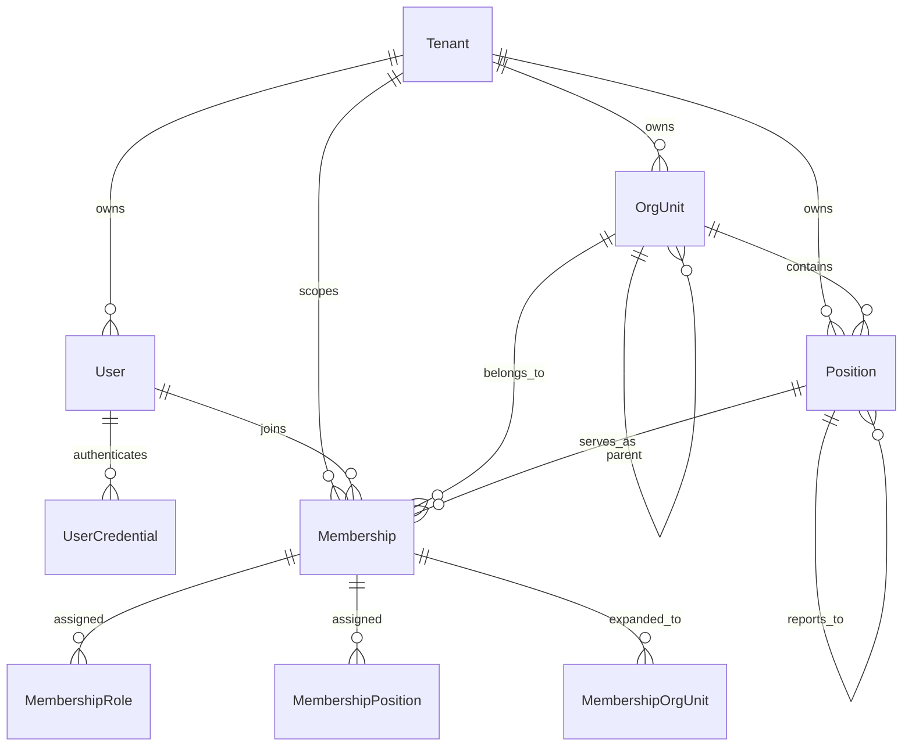
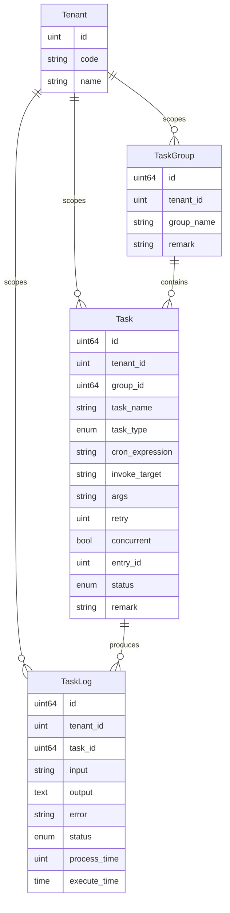

# Ent Schema Overview

本文概览 `xkit/examples/admin/schema` 下的实体模型，帮助快速理解当前后台数据层的领域划分、核心关系、多租户语义，以及 task 领域在当前版本中的正式位置。

## 1. Overall Domain Map

当前 schema 可以粗分为 8 个领域：

- 租户与身份：`Tenant`、`User`、`UserCredential`
- 组织与岗位：`OrgUnit`、`Position`、`Membership`
- 角色与权限：`Role`、`Permission`、`PermissionGroup`、`PermissionPolicy`
- 资源与路由：`Api`、`Menu`
- 字典与国际化：`DictCategory`、`DictCategoryI18n`、`DictLabel`、`DictLabelI18n`、`Language`
- 站内消息：`InternalMessage`、`InternalMessageCategory`、`InternalMessageRecipient`
- 审计与运维：登录、接口、数据访问、权限、策略评估、文件等
- 任务调度：`TaskGroup`、`Task`、`TaskLog`

大部分业务实体都通过 mixin 共享：

- 主键：`id`
- 审计字段：`created_at`、`updated_at`、`created_by`、`updated_by`
- 多租户字段：`tenant_id`
- 扩展字段：`remark`、`description`、`status`、`sort_order`

## 2. Permission Core View

这张图聚焦权限主链路：



## 3. Identity And Organization View

这张图聚焦租户、用户、组织、岗位、成员身份主链路：



## 4. Task Domain View

task 现在已经是明确的独立领域，不再只是“附带一个 task 表”。

当前任务领域图：



### 当前 task 结构约束

- `task.group_id` 必填。
- `task_group.remark` 保留。
- `task.group_name` 不在 `task` 上冗余存储。
- `task_log.job_id` 已统一改为 `task_id`。
- 调度表达当前只保留 `cron_expression`，不再保留之前拆散的 schedule 字段。
- `status` 保留，`is_enabled` 已去除。

### 当前运行语义

- `tenant_id = 0` 表示平台级全局任务。
- 非零 `tenant_id` 表示租户级任务。
- 当前内置默认任务使用平台级租户语义。

## 5. Task Runtime Relationship

虽然 schema 只描述存储，但 task 领域已经和运行时架构形成明确配套关系：

- `task_group`：任务分组资源
- `task`：任务定义资源
- `task_log`：任务执行结果资源

运行时则由 `admin/internal/task/runtime` 和 `admin/internal/task` 负责：

- `Registry`
- `Runner`
- `Scheduler`
- `TaskRuntimeStore`

也就是说：

- schema 负责表达任务定义和结果
- runtime 负责恢复、调度、执行、日志编排

## 6. Design Notes

### 多租户

- 多租户仍是第一原则，task 领域同样带 `tenant_id`。
- 平台任务和租户任务共享同一套 schema，只靠 `tenant_id` 语义区分。

### 关系建模

- 当前不少关系仍通过 `*_id` 字段表达，并非所有关联都显式建成 Ent `Edges()`。
- 对 task 领域而言，最关键的是：
  - `Task.group_id -> TaskGroup.id`
  - `TaskLog.task_id -> Task.id`

### 调度表达

- 当前后端和前端已统一到 6 段 cron：

```text
秒 分 时 日 月 周
```

## 7. Suggested Reading Order

建议按以下顺序阅读 schema：

1. `tenant.go`、`user.go`、`user_credential.go`
2. `org_unit.go`、`position.go`、`membership.go`
3. `role.go`、`permission.go`、`role_permission.go`
4. `api.go`、`menu.go`、`permission_api.go`、`permission_menu.go`
5. `task_group.go`、`task.go`、`task_log.go`
6. 其余字典、消息、审计、文件相关 schema

## 8. Related Runtime Docs

若要继续 task 领域工作，除了 schema 外，还应同时阅读：

- `admin/docs/task-runtime-architecture.md`
- `admin/docs/task-decoupling-design.md`
- `admin/docs/task-executor-convention.md`
- `xkit/NEXT_CONTEXT_HANDOFF_20260608.md`
