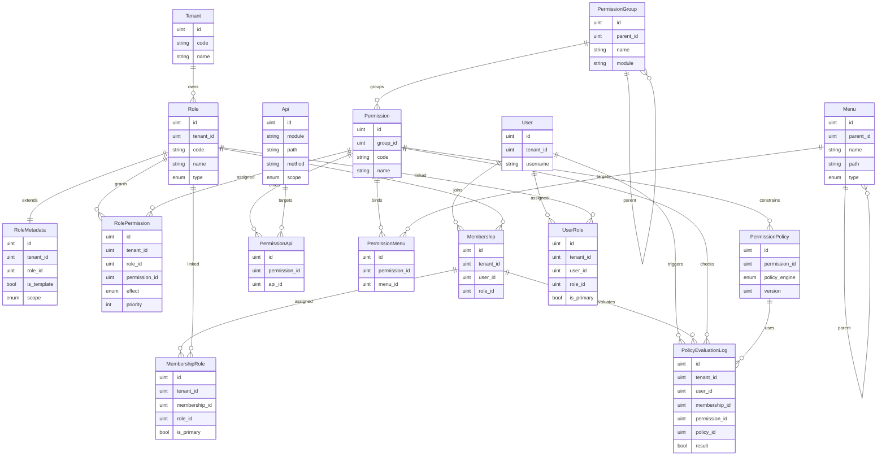
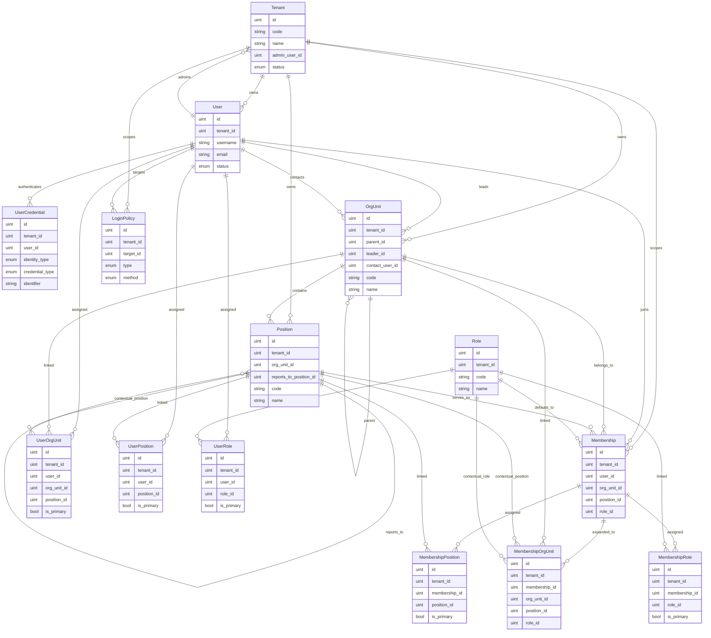

# Ent Schema Overview

本文档梳理 `internal/data/ent/schema` 下的实体模型，帮助快速理解当前后台数据层的领域划分、核心关系与多租户设计。

## 总览

当前 schema 可以分为 7 个领域：

- 租户与身份：`Tenant`、`User`、`UserCredential`
- 组织与岗位：`OrgUnit`、`Position`、`Membership`
- 角色与权限：`Role`、`Permission`、`PermissionGroup`、`PermissionPolicy`
- 资源与路由：`Api`、`Menu`
- 字典与国际化：`DictType`、`DictEntry`、`DictEntryI18n`、`Language`
- 站内消息：`InternalMessage`、`InternalMessageCategory`、`InternalMessageRecipient`
- 审计与运维：登录、接口、数据访问、权限、策略评估、任务、文件等

大部分业务实体都通过 mixin 共享以下基础字段：

- 主键：`id`
- 审计字段：`created_at`、`updated_at`、`created_by`、`updated_by`
- 多租户字段：`tenant_id`
- 扩展字段：`remark`、`description`、`status`、`sort_order` 等按需出现

需要注意的是：当前不少关系是通过 `*_id` 字段表达的，并没有全部声明为 Ent `Edges()`。下面把主图拆成两张聚焦图：一张用于看权限主链路，一张用于看组织与身份主链路；其余如字典、消息、文件、任务、审计等独立领域放在后文说明。

## 核心权限图

这张图重点回答三个问题：角色拥有哪些权限、权限如何映射到 API / 菜单、动态策略如何参与授权判定。

## 组织身份图

这张图重点回答四个问题：用户属于哪个租户、在哪些组织单元、承担哪些岗位、这些归属是通过直接关联还是通过成员身份聚合实现。

## 领域说明

### 1. 租户与身份

- `Tenant` 是多租户根实体，负责租户基本信息、订阅状态、管理员用户等。
- `User` 是租户内用户主体，用户名、邮箱、手机号、登录状态等都挂在这里。
- `UserCredential` 用于承载登录标识与凭据，支持用户名、邮箱、手机号、OAuth、SSO、API Key 等多种认证方式。
- `LoginPolicy` 是登录限制策略表，按租户和目标用户控制 IP、设备、地域、时间等访问限制。

### 2. 组织、岗位与成员身份

- `OrgUnit` 是组织树，使用 `Tree` mixin，自带 `parent_id`、`children` 一类层级结构能力。
- `Position` 表示岗位，关联组织单元，并支持 `reports_to_position_id` 描述汇报链。
- `Membership` 是“成员身份”聚合根，用来把 `User`、`OrgUnit`、`Position`、`Role` 汇在一个身份上下文中。
- `MembershipOrgUnit`、`MembershipPosition`、`MembershipRole` 是 `Membership` 的拆分型扩展表，适合一个成员身份挂多个组织、多个岗位、多个角色。
- `UserOrgUnit`、`UserPosition`、`UserRole` 是面向用户的直接关联表，适合不经 `Membership` 也能快速读取用户归属关系。

### 3. 角色、权限与策略

- `Role` 是角色定义，支持系统模板角色、租户角色和受保护角色。
- `RoleMetadata` 存储角色模板元数据、同步版本、同步策略和租户覆盖项。
- `PermissionGroup` 是权限分组树，用于把权限点按模块或业务域组织起来。
- `Permission` 是权限点本体，`group_id` 指向权限分组。
- `RolePermission` 建立角色与权限点的多对多关系，并带 `effect`、`priority`，说明该角色对权限点的授予方式。
- `PermissionPolicy` 进一步为权限点配置动态策略，支持 `CEL`、`Casbin`、`OPA`、`SQL` 等策略引擎。
- `PolicyEvaluationLog` 记录权限判定过程，能回溯“谁、以什么成员身份、对哪个权限点、在什么上下文里被允许或拒绝”。

### 4. 资源与前后端权限映射

- `Api` 描述后端接口资源，唯一键主要由 `module + path + method + scope` 构成。
- `Menu` 描述前端菜单资源，同样是树结构，支持目录、菜单、按钮、内嵌页、外链等类型。
- `PermissionApi` 把权限点映射到接口资源。
- `PermissionMenu` 把权限点映射到菜单资源。
- 这一层意味着系统采用了“权限点居中”的设计：角色不直接绑 API 或菜单，而是先绑定 `Permission`，再由 `Permission` 连接资源。

### 5. 字典与国际化

- `DictType` 是字典类型，如状态、枚举、业务配置项分类。
- `DictEntry` 是具体字典项，显式通过 Ent edge 归属到 `DictType`。
- `DictEntryI18n` 是字典项的多语言显示值，也显式通过 Ent edge 归属到 `DictEntry`。
- `Language` 当前是独立语言主数据，`DictEntryI18n` 通过 `language_code` 与其形成软关联，而非强外键。

### 6. 站内消息

- `InternalMessageCategory` 是消息分类。
- `InternalMessage` 是消息主表，记录发送者、分类、消息状态与类型。
- `InternalMessageRecipient` 是接收人状态表，记录某条消息被谁接收、是否已读、何时送达。
- 这组模型支持“一条消息，多名接收人”的投递模式。

### 7. 文件、任务与审计

- `File` 是租户级文件元数据表，适合统一接 OSS、本地存储、MinIO 等对象存储。
- `Task` 是租户级任务定义表，支持周期任务、延迟任务与等待结果任务。
- `ApiAuditLog`、`DataAccessAuditLog`、`LoginAuditLog`、`OperationAuditLog`、`PermissionAuditLog`、`PolicyEvaluationLog` 共同组成审计闭环。
- 这些日志表大多通过 `user_id`、`operator_id`、`request_id`、`trace_id` 等字段与用户和请求上下文形成关联，但当前主要以字段方式保存，没有统一显式外键边。

## 关系设计特点

- 多租户隔离是第一原则，绝大多数核心业务表都带 `tenant_id`。
- 树结构实体有 3 个：`OrgUnit`、`Menu`、`PermissionGroup`。
- 身份建模分两层：既有面向最终用户的直接关联表，也有面向复杂授权场景的 `Membership` 聚合。
- 权限建模分三层：`Role -> Permission -> Resource(Api/Menu)`，并可叠加 `PermissionPolicy` 做动态授权。
- 国际化目前采用“语言码软关联”，迁移成本低，但数据库层不保证 `DictEntryI18n.language_code` 一定存在于 `Language`。

## 建议的阅读顺序

如果是第一次接触这套模型，建议按下面顺序阅读源码：

1. `tenant.go`、`user.go`、`user_credential.go`
2. `org_unit.go`、`position.go`、`membership.go`
3. `role.go`、`permission.go`、`role_permission.go`、`permission_policy.go`
4. `api.go`、`menu.go`、`permission_api.go`、`permission_menu.go`
5. `dict_type.go`、`dict_entry.go`、`dict_entry_i18n.go`
6. 消息、文件、任务、审计相关 schema
